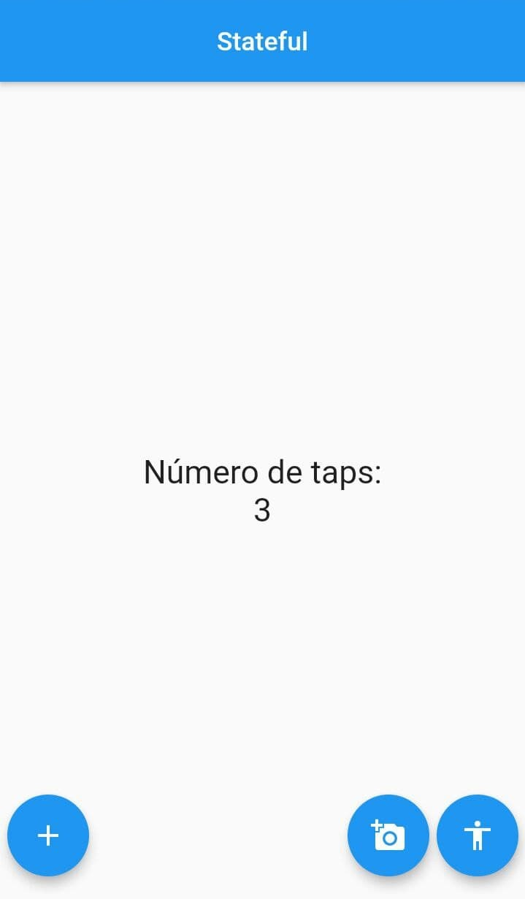

# Contador

Aplicación en Flutter del curso "[_Flutter: Una introducción al SDK de Google_](https://www.udemy.com/course/flutter-prieros-pasos)" del profesor Fernando Herrera.

## Descripción

Este proyecto cubre lo aprendido en el capítulo 5 del curso donde se tocan los Widgets principales para iniciar una aplicación móvil que lleve un contador.

La aplicación cuenta con tres botones que van a llevar el conteo: la suma, la resta y el reset.
